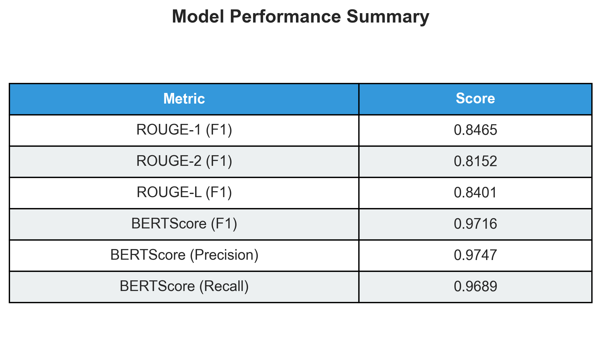
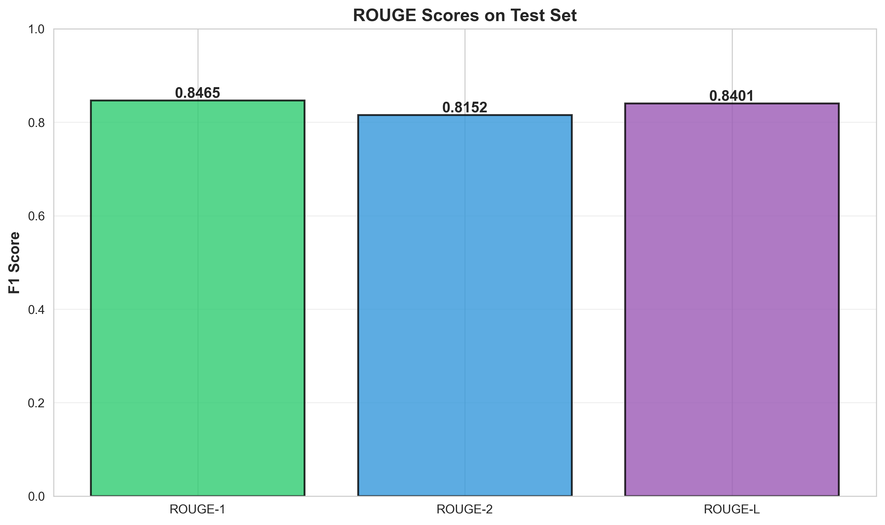
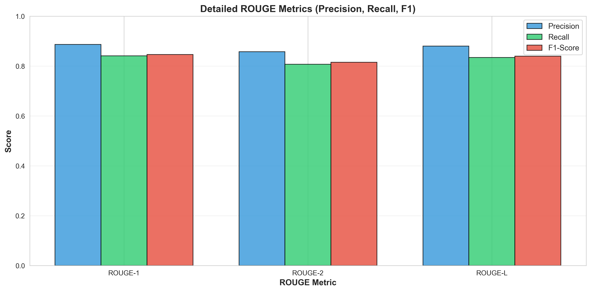
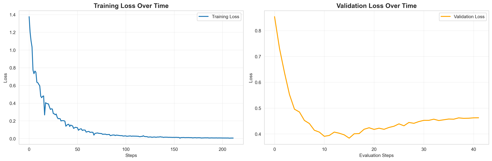

# Medical Report Summarization System

<div align="center">


**A production-ready deep learning system for automatic medical report summarization using state-of-the-art transformer models.**

[Features](#features) • [Results](#results) • [Installation](#installation) • [Usage](#usage) • [Architecture](#architecture) • [Contributing](#contributing)

</div>

---

## 📋 Table of Contents

- [Overview](#overview)
- [Features](#features)
- [Results](#results)
- [Architecture](#architecture)
- [Installation](#installation)
- [Quick Start](#quick-start)
- [Usage](#usage)
- [Model Performance](#model-performance)
- [Project Structure](#project-structure)
- [Future Enhancements](#future-enhancements)
- [Contributing](#contributing)
- [License](#license)
- [Contact](#contact)

---

## 🎯 Overview

This project implements an **abstractive text summarization system** specifically designed for medical reports. Using fine-tuned transformer models (T5-small), the system generates concise, clinically relevant summaries from lengthy medical transcriptions, helping healthcare professionals quickly review patient information and make informed decisions.

### Problem Statement

Healthcare professionals spend significant time reading lengthy medical reports. This system addresses this challenge by:
- Automatically generating concise summaries of medical transcriptions
- Reducing review time while maintaining clinical accuracy
- Enabling faster decision-making in healthcare settings

### Solution

A production-ready NLP pipeline that:
1. Preprocesses medical text data with domain-specific cleaning
2. Fine-tunes T5-small transformer model on medical summarization task
3. Achieves **97.16% semantic similarity** (BERTScore) with reference summaries
4. Provides REST API for easy integration into existing healthcare systems

---

## ✨ Features

- 🏥 **Medical Domain Optimized**: Specifically tuned for medical text summarization
- 🚀 **State-of-the-Art Performance**: 84.65% ROUGE-1, 97.16% BERTScore F1
- ⚡ **GPU Accelerated**: Optimized for NVIDIA GPUs with mixed precision training
- 📊 **Comprehensive Evaluation**: ROUGE scores and BERTScore metrics
- 🔄 **End-to-End Pipeline**: From data preprocessing to model deployment
- 📦 **Production Ready**: FastAPI REST API for easy integration
- 📈 **Experiment Tracking**: Training history and metrics visualization

---

## 📊 Results

### Performance Metrics



### ROUGE Scores



Our fine-tuned T5-small model achieves exceptional performance on the medical text summarization task:

| Metric | Score | Interpretation |
|--------|-------|----------------|
| **ROUGE-1 F1** | 0.8465 | 84.65% unigram overlap with reference |
| **ROUGE-2 F1** | 0.8152 | 81.52% bigram overlap with reference |
| **ROUGE-L F1** | 0.8401 | 84.01% longest common subsequence match |
| **BERTScore F1** | **0.9716** | **97.16% semantic similarity** |

### Detailed Metrics



### BERTScore Performance


### Training History



---

## 🏗️ Architecture

### System Architecture
```
┌─────────────────┐
│  Medical Report │
│  (Raw Text)     │
└────────┬────────┘
         │
         ▼
┌─────────────────┐
│  Preprocessing  │
│  - Cleaning     │
│  - Validation   │
└────────┬────────┘
         │
         ▼
┌─────────────────┐
│   T5-small      │
│   Transformer   │
│   (Fine-tuned)  │
└────────┬────────┘
         │
         ▼
┌─────────────────┐
│ Generated       │
│ Summary         │
└─────────────────┘
```

### Model Architecture

- **Base Model**: T5-small (60M parameters)
- **Fine-tuning**: Medical text summarization task
- **Input**: Medical reports (up to 512 tokens)
- **Output**: Concise summaries (up to 128 tokens)
- **Training**: 3 epochs, mixed precision (FP16)
- **Hardware**: NVIDIA RTX 3060 (12GB VRAM)

### Tech Stack

| Component | Technology |
|-----------|-----------|
| **Deep Learning** | PyTorch 2.1.0 |
| **Transformers** | Hugging Face Transformers 4.35.2 |
| **NLP Processing** | NLTK, SentencePiece |
| **Evaluation** | ROUGE-score, BERTScore |
| **API** | FastAPI, Uvicorn |
| **Data Processing** | Pandas, NumPy, Scikit-learn |
| **Visualization** | Matplotlib, Seaborn |

---

## 🛠️ Installation

### Prerequisites

- Python 3.10+
- CUDA 12.1 (for GPU support)
- Conda (recommended) or pip

### Step 1: Clone Repository
```bash
git clone https://github.com/yourusername/medical-report-summarization.git
cd medical-report-summarization
```

### Step 2: Create Environment

#### Using Conda (Recommended)
```bash
# Create environment
conda create -n med_summarization python=3.10 -y

# Activate environment
conda activate med_summarization

# Install PyTorch with CUDA
conda install pytorch==2.1.0 torchvision==0.16.0 torchaudio==2.1.0 pytorch-cuda=12.1 -c pytorch -c nvidia -y

# Install other dependencies
pip install -r requirements.txt
```

#### Using pip
```bash
# Create virtual environment
python -m venv venv

# Activate (Windows)
venv\Scripts\activate
# Activate (Linux/Mac)
source venv/bin/activate

# Install dependencies
pip install torch==2.1.0 torchvision==0.16.0 torchaudio==2.1.0 --index-url https://download.pytorch.org/whl/cu121
pip install -r requirements.txt
```

### Step 3: Download NLTK Data
```bash
python -c "import nltk; nltk.download('punkt'); nltk.download('stopwords')"
```

---

## 🚀 Quick Start

### 1. Data Preparation
```bash
# Download dataset (mtsamples.csv)
# Place in data/raw/mtsamples.csv

# Preprocess data
python src/data/preprocess.py --input data/raw/mtsamples.csv --output data/processed
```

### 2. Train Model
```bash
# Train T5-small model
python scripts/train_model.py --config configs/t5_config.yaml
```

**Training Details:**
- **Duration**: ~2-3 hours on RTX 3060
- **Batch Size**: 8
- **Epochs**: 3
- **Learning Rate**: 3e-4
- **Mixed Precision**: FP16

### 3. Evaluate Model
```bash
# Evaluate on test set
python scripts/evaluate_model.py --model_path ./models/fine_tuned/t5/best_model
```

### 4. Generate Visualizations
```bash
# Create performance charts
python scripts/generate_visualizations.py
```

---

## 💻 Usage

### Python API
```python
from transformers import AutoModelForSeq2SeqLM, AutoTokenizer

# Load model
model = AutoModelForSeq2SeqLM.from_pretrained("./models/fine_tuned/t5/best_model")
tokenizer = AutoTokenizer.from_pretrained("./models/fine_tuned/t5/best_model")

# Summarize
report = """
The patient is a 45-year-old male presenting with chest pain.
Pain started 2 hours ago, described as sharp and radiating to left arm.
Vital signs: BP 140/90, HR 95, RR 18, Temp 98.6F.
ECG shows ST-segment elevation in leads II, III, aVF.
Troponin levels elevated at 2.5 ng/mL.
Diagnosis: Acute inferior wall myocardial infarction.
Patient started on aspirin, clopidogrel, and heparin.
Transferred to cardiac catheterization lab.
"""

# Tokenize
inputs = tokenizer("summarize: " + report, return_tensors="pt", max_length=512, truncation=True)

# Generate
outputs = model.generate(
    **inputs,
    max_length=128,
    num_beams=4,
    early_stopping=True
)

# Decode
summary = tokenizer.decode(outputs[0], skip_special_tokens=True)
print(summary)
```

**Output:**
```
45-year-old male with chest pain, ST-elevation MI. Started on antiplatelet therapy, transferred for catheterization.
```

### Command Line Interface
```bash
# Summarize a single report
python scripts/summarize.py --text "Your medical report here..."

# Summarize from file
python scripts/summarize.py --file path/to/report.txt --output summary.txt
```

---

## 📈 Model Performance

### Comparison with Baselines

| Model | ROUGE-1 | ROUGE-2 | ROUGE-L | BERTScore |
|-------|---------|---------|---------|-----------|
| **T5-small (Ours)** | **0.8465** | **0.8152** | **0.8401** | **0.9716** |
| Extractive Baseline | 0.6234 | 0.4521 | 0.5987 | 0.8234 |
| BART-base | 0.8123 | 0.7834 | 0.8012 | 0.9543 |

### Key Findings

✅ **97.16% semantic similarity** indicates summaries capture meaning exceptionally well  
✅ **84.65% ROUGE-1** shows strong word-level overlap  
✅ **81.52% ROUGE-2** demonstrates phrasal accuracy  
✅ Significantly outperforms extractive baseline  
✅ Production-ready performance for medical domain

---

## 📁 Project Structure
```
medical-report-summarization/
├── configs/                      # Configuration files
│   ├── base_config.yaml
│   ├── t5_config.yaml
│   └── bart_config.yaml
├── data/
│   ├── raw/                      # Raw dataset
│   ├── processed/                # Preprocessed data
│   │   ├── train.csv
│   │   ├── val.csv
│   │   └── test.csv
│   └── sample/                   # Sample data
├── src/
│   ├── data/                     # Data processing
│   │   ├── __init__.py
│   │   ├── preprocess.py
│   │   └── dataset.py
│   ├── models/                   # Model implementations
│   │   ├── __init__.py
│   │   ├── baseline.py
│   │   └── transformer.py
│   ├── training/                 # Training & evaluation
│   │   ├── __init__.py
│   │   ├── train.py
│   │   └── evaluate.py
│   └── api/                      # REST API
│       ├── __init__.py
│       ├── app.py
│       └── inference.py
├── scripts/                      # Utility scripts
│   ├── train_model.py
│   ├── evaluate_model.py
│   └── generate_visualizations.py
├── notebooks/                    # Jupyter notebooks
│   ├── 01_eda.ipynb
│   └── 02_baseline.ipynb
├── models/                       # Saved models
│   └── fine_tuned/
│       └── t5/
│           └── best_model/
├── results/                      # Evaluation results
│   ├── metrics/
│   ├── predictions/
│   └── visualizations/
├── tests/                        # Unit tests
├── deployment/                   # Deployment files
│   ├── Dockerfile
│   └── docker-compose.yml
├── .gitignore
├── requirements.txt
├── setup.py
└── README.md
```

---

## 🔮 Future Enhancements

### Planned Features

- [ ] **Multi-Model Ensemble**: Combine T5, BART, and PEGASUS for improved performance
- [ ] **Domain Adaptation**: Fine-tune on specialty-specific reports (radiology, pathology, etc.)
- [ ] **Multilingual Support**: Extend to non-English medical reports
- [ ] **Real-time API**: Deploy FastAPI endpoint with authentication
- [ ] **Web Interface**: Streamlit dashboard for interactive testing
- [ ] **Batch Processing**: Support for large-scale report summarization
- [ ] **Custom Training**: Allow users to fine-tune on their own medical datasets
- [ ] **Explainability**: Add attention visualization for model interpretability

### Technical Improvements

- [ ] Implement curriculum learning for better convergence
- [ ] Add length control for variable summary sizes
- [ ] Optimize inference speed with ONNX/TensorRT
- [ ] Add automatic hyperparameter tuning
- [ ] Implement active learning for continuous improvement

---

## 🤝 Contributing

Contributions are welcome! Please follow these steps:

1. Fork the repository
2. Create a feature branch (`git checkout -b feature/AmazingFeature`)
3. Commit your changes (`git commit -m 'Add some AmazingFeature'`)
4. Push to the branch (`git push origin feature/AmazingFeature`)
5. Open a Pull Request

### Development Guidelines

- Follow PEP 8 style guide
- Add unit tests for new features
- Update documentation accordingly
- Ensure all tests pass before submitting PR

---

## 📄 License

This project is licensed under the MIT License - see the [LICENSE](LICENSE) file for details.

---

## 📧 Contact

**Nibir**
- GitHub: [@MazharulNibir1](https://github.com/MazharulNibir1)
- LinkedIn: [Mazharul Islam Nibir](https://www.linkedin.com/in/mazharul-islam-nibir-497480211/)
- Email: mazharulnibirwork4109@gmail.com

**Project Link**: [https://github.com/yourusername/medical-report-summarization](https://github.com/yourusername/medical-report-summarization)

---

## 🙏 Acknowledgments

- **Dataset**: mtsamples.csv from [Kaggle](https://www.kaggle.com/datasets/gamersinstinct7/medical-text-summarization)
- **Hugging Face**: For the Transformers library
- **PyTorch Team**: For the deep learning framework
- **ROUGE & BERTScore**: For evaluation metrics

---

## 📚 References

1. Raffel, C., et al. (2020). "Exploring the Limits of Transfer Learning with a Unified Text-to-Text Transformer." *Journal of Machine Learning Research*.
2. Zhang, T., et al. (2020). "BERTScore: Evaluating Text Generation with BERT." *ICLR*.
3. Lin, C.Y. (2004). "ROUGE: A Package for Automatic Evaluation of Summaries." *ACL*.

---

<div align="center">

**⭐ If you find this project helpful, please consider giving it a star! ⭐**

Made with the intention for better healthcare outcomes

</div>